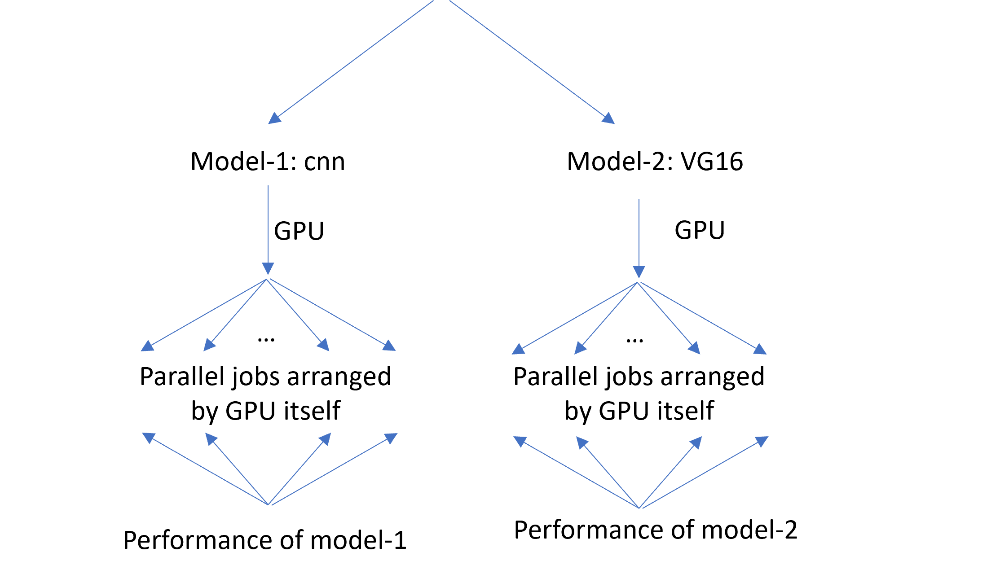

### InterestingProject_STAT605

##### -- Animal Species Classification --

[Dataset](https://www.kaggle.com/datasets/utkarshsaxenadn/animal-image-classification-dataset/data): So as to satisfy the requirement that dataset size should be large enough to warrant the use of the compute clusters (either the Statistics HPC or the CHTC)–about 10 to 100 GB, our group used `Train Augmented` as traing set, `Validation Data` as validation set and `Testing Data` as test set. We also take `Interesting data` into our consideridation to both test the robust of our model and make our project more interesting.

Our **parallel jobs** includes two parts:

